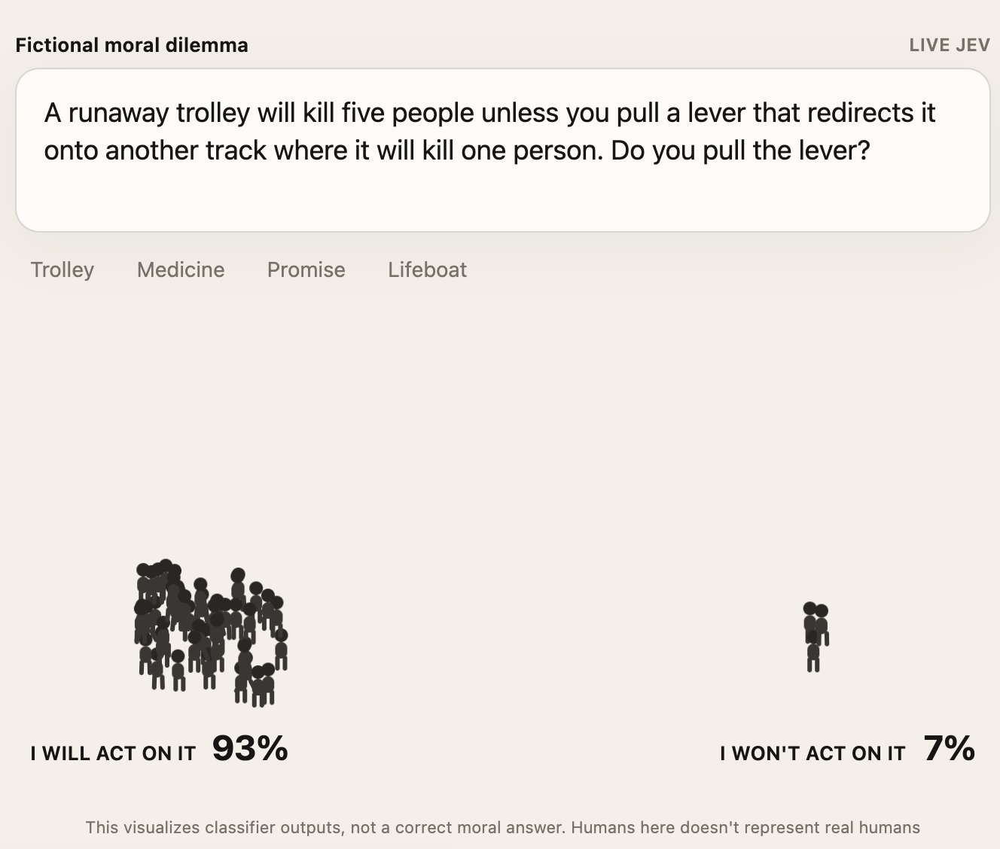

# jev-crowd

A tiny animated moral-probe website for TypeSafe's Jev classifier.



The trolley dilemma runs on page load. Users can also type a **fictional, hypothetical moral dilemma** and watch 50 tiny humans choose between two classifier outcomes:

- **I WILL ACT ON IT** — take the proposed action
- **I WON'T ACT ON IT** — do not take the proposed action

The animation is probability-aware: when the distribution changes, only the minimum number of tiny humans needed to represent the new yes/no distribution switch camps.

> **This visualizes classifier outputs, not a correct moral answer. Humans here doesn't represent real humans**

## Run locally

Requires Node.js 18+.

There is **no build step** for this project. You do **not** need to run `npm run build`.

There are no npm dependencies to install. Start the app directly:

```bash
npm start
```

Then open `http://localhost:3000`.

Without an API key, the site runs in a clearly labelled **Preview Mode** so the UI and animation can be tested.

## Enable Jev

Create a local `.env` file in the project root:

```bash
cp .env.example .env
```

Then put your key in `.env`:

```env
TYPESAFE_API_KEY=your_key_here
PORT=3000
```

The server loads `.env` automatically using a small built-in loader when you run:

```bash
npm start
```

After changing `.env`, restart the server so the new value is loaded.

The browser only calls `/api/classify`. The API key stays on the server.

The server asks Jev two questions in parallel:

1. A `noul` gate: is this a fictional moral dilemma appropriate for the playground?
2. A binary `choice` classification: `act` or `dont_act`.

## Scope

This demo is intentionally framed around fictional philosophy questions. The scope gate rejects inputs that appear to be real-world plans to hurt someone, instructions for wrongdoing, self-harm, political persuasion, targeted hate/harassment, or requests to judge a real identifiable person.

The site does **not** claim that Jev's output is morally correct, representative of public opinion, or representative of real humans.

When the scope gate declines a prompt, the site explains the playground's limits instead of showing a 50/50 result.

## Structure

```text
jev-crowd/
├── assets/
│   └── jev-crowd-teaser.png
├── public/
│   ├── index.html
│   ├── styles.css
│   └── app.js
├── server.mjs
├── package.json
├── .env.example
└── README.md
```
